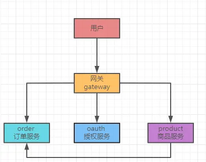
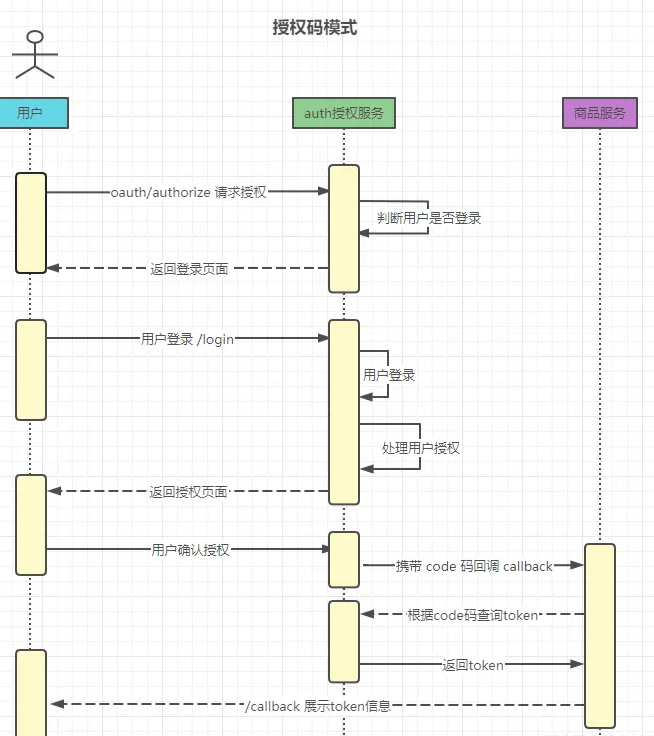
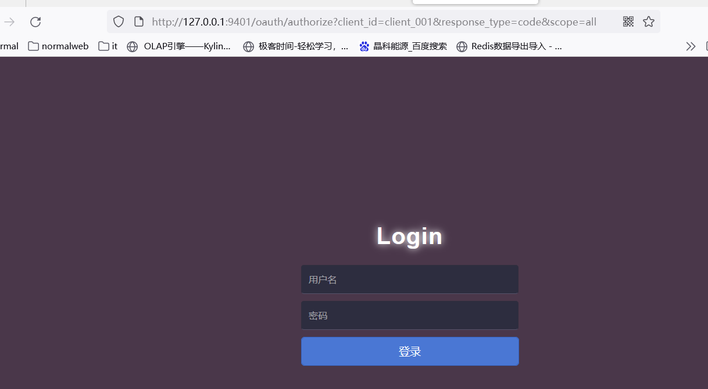
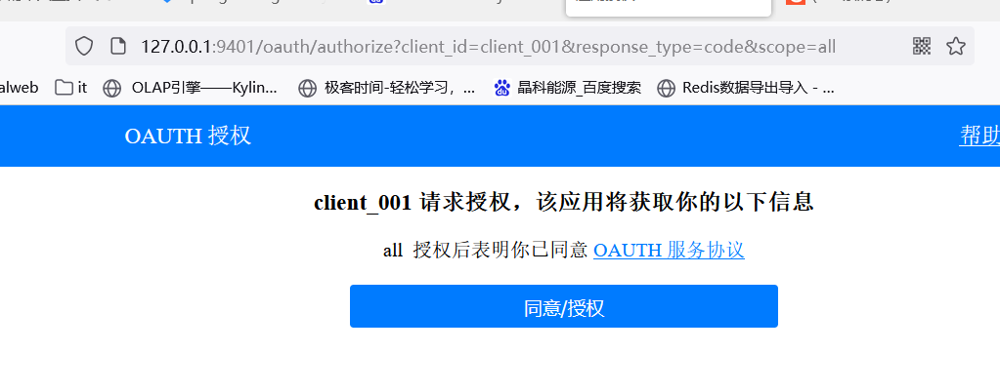
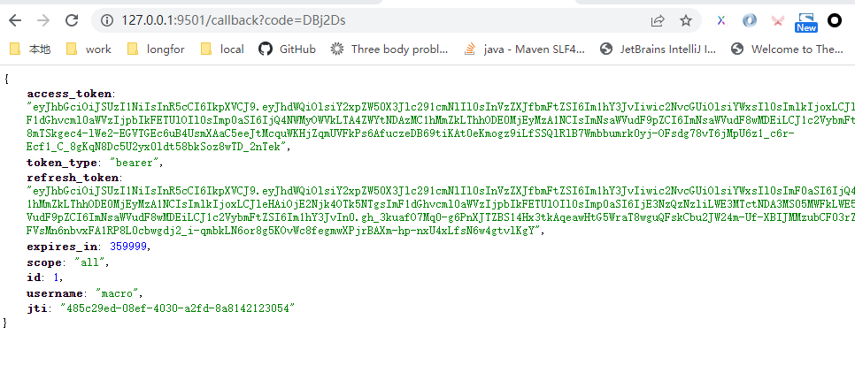
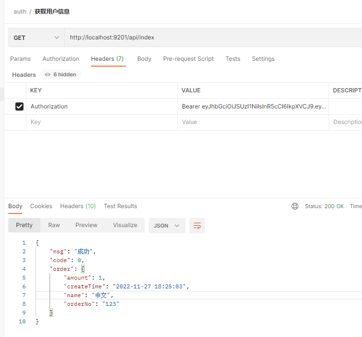
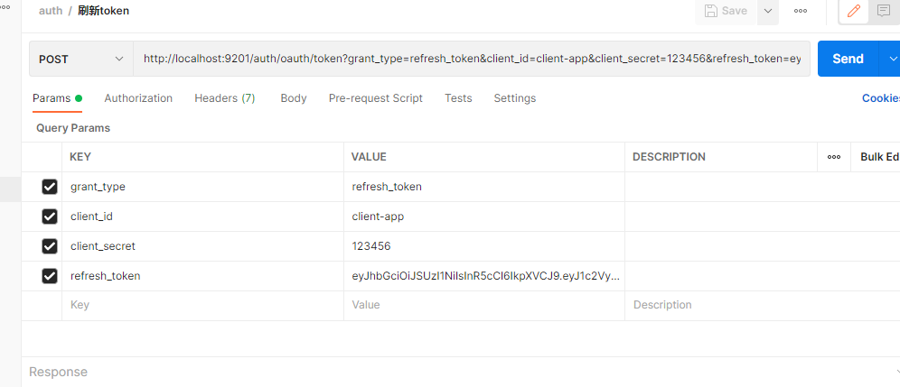

# 工程简介
该项目是使用 springcloud ，结合了 oauth2.0 和 springsecurity 进行开发授权和用户鉴权，项目使用了 mysql 和 redis 进行数据和配置的存储，使用 gateway 作为网关配置。

该项目项目结构如下图所示：



#### 1 oauth 2.0 授权码时序图





#### 2 用户登录页面



#### 3 获取授权页面
```

授权码模式
http://127.0.0.1:9401/oauth/authorize?client_id=client_001&response_type=code&scope=all
```



#### 4 回调获取token 信息




#### 5 请求数据接口




#### 6 刷新token 信息




```
# 项目参考文章
https://blog.kdyzm.cn/post/24
https://juejin.cn/post/7170578607754969118
https://juejin.cn/post/7121892567130013732


gateway route 配置
https://blog.csdn.net/wuweuhai/article/details/124943247

```

```mysql

-- 查询数据库表字段
SELECT COLUMN_NAME as 'name', DATA_TYPE as 'type' , COLUMN_COMMENT as 'comment', ordinal_position as 'srt' 
FROM information_schema.`COLUMNS` 
WHERE TABLE_SCHEMA = 'account'  AND TABLE_NAME = 'user' order by ordinal_position ;

-- DATE_SUB()和DATE_ADD()函数，实现日期增减
--  当前时间减30分钟
select DATE_SUB(SYSDATE(),INTERVAL 30 MINUTE);
--  当前时间减1天
select DATE_SUB(SYSDATE(),INTERVAL 1 day);
--  当前时间减1小时            
select DATE_SUB(SYSDATE(),INTERVAL 1 hour);
--  当前时间减1秒             
select DATE_SUB(SYSDATE(),INTERVAL 1 second);
--  当前时间减1星期   
select DATE_SUB(SYSDATE(),INTERVAL 1 week);
--  当前时间减1个月      
select DATE_SUB(SYSDATE(),INTERVAL 1 month);
--  当前时间减1季度          
select DATE_SUB(SYSDATE(),INTERVAL 1 quarter);
-- 当前时间减1年        
select DATE_SUB(SYSDATE(),INTERVAL 1 year);

and create_time <![CDATA[ < ]]> DATE_ADD(STR_TO_DATE(#{endDate},'%Y-%m-%d'), interval 1 day)

DATE_FORMAT(NOW(),'%b %d %Y %h:%i %p')
DATE_FORMAT(NOW(),'%m-%d-%Y')
DATE_FORMAT(NOW(),'%d %b %y')
DATE_FORMAT(NOW(),'%d %b %Y %T:%f')

```


1 当前线程池的线程数已经是配置的最大线程数，添加到队列
2 已经提交的任务和活动的任务是否小于当前的活动的线程数，添加到队列
3 当前活动的线程数小于最大线程数，返回 false ,添加 worker 任务
4 其它情况添加到等待队列中

Tomcat 的默认核心线程数是 10，最大线程数 200，队列长度是无限长。
https://juejin.cn/post/7285622727603388452

用户系统
订单系统
交易系统
支付系统
商品系统
结算系统
商户系统


```


#### gitee 第三方登录
```

登录获取 code
get https://gitee.com/oauth/authorize?client_id={client_id}&redirect_uri={redirect_uri}&response_type=code
回调获取 code

通过 code 获取 access_token 信息
post https://gitee.com/oauth/token?grant_type=authorization_code&code={code}&client_id={client_id}&redirect_uri={redirect_uri}&client_secret={client_secret}
json 获取 access_token expires_in refresh_token

通过access_token 获取用户信息 
get https://gitee.com/api/v5/user?access_token={access_token}

通过 refresh_token 的方式刷新 token 
post https://gitee.com/oauth/token?grant_type=refresh_token&refresh_token={refresh_token}


OpenID Connect建立在OAuth之上，OpenID Connect（通常缩写为 OIDC）
oauth2 一般是作为授权而非认证
OIDC = Oauth2 + 认证机制

OAuth 中有四个主要参与者：

资源所有者 （RO）：控制 API 公开的数据的实体，通常是最终用户
客户端：移动应用程序、网站等想要代表资源所有者访问数据
授权服务器 （AS）：安全令牌服务 （STS），或者通俗地说，颁发令牌的 OAuth 服务器
资源服务器 （RS）：公开数据的服务，即 API

Aviator 表达式 
Guava maps表达式 

代码精简 
https://juejin.cn/post/7347905080508547099

```
