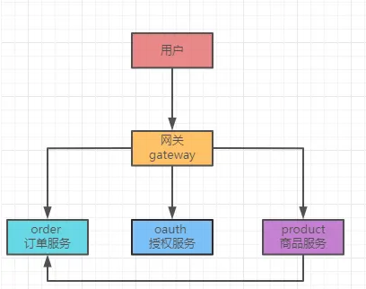

# 工程简介
该项目是使用 springcloud ，结合了 oauth2.0 和 springsecurity 进行开发授权和用户鉴权，项目使用了 mysql 和 redis 进行数据和配置的存储，使用 gateway 作为网关配置。

该项目项目结构如下图所示：



#### 1 oauth 2.0 授权码时序图


#### 2 用户登录页面


#### 3 获取授权页面
```

授权码模式
http://127.0.0.1:9401/oauth/authorize?client_id=client_001&response_type=code&scope=all
```


#### 4 回调获取token 信息


#### 5 请求数据接口


#### 6 刷新token 信息


```
# 项目参考文章
https://blog.kdyzm.cn/post/24
https://juejin.cn/post/7170578607754969118
https://juejin.cn/post/7121892567130013732


gateway route 配置
https://blog.csdn.net/wuweuhai/article/details/124943247

```